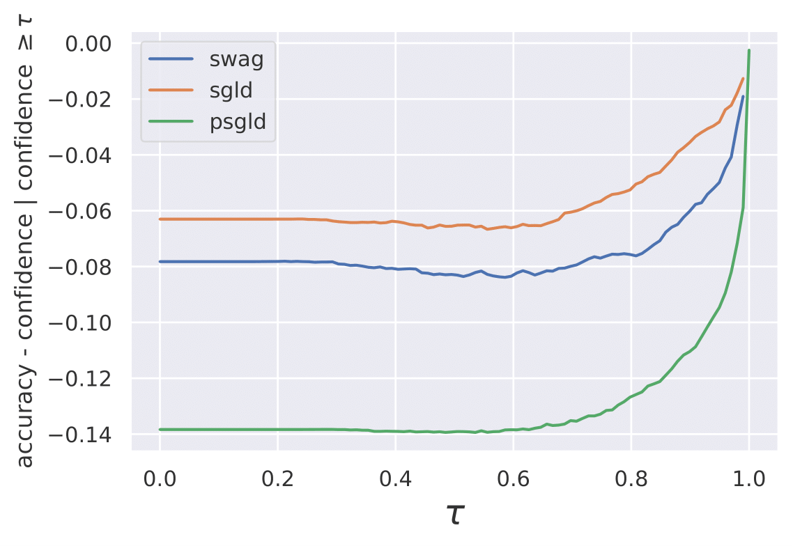
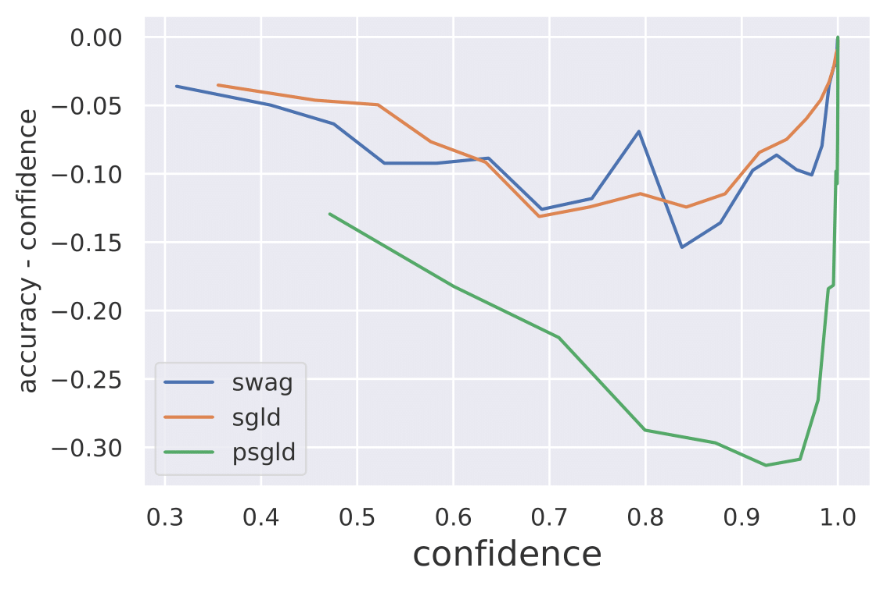

# Uncertainty Quantification in Federated Learning

This repository contains a PyTorch code for the experiments conducted in my Bachelor Thesis.

[Deriving FL-SWAG for the sake of calibration and privacy protection](https://github.com/makni-mehdi/federated-swag/blob/main/Bachelor%20Thesis%20Report.pdf)

Bachelor Thesis Report at [École Polytechnique](https://www.polytechnique.edu/en)  and the [Lagrange Mathematics and Computing Research Center](https://www.huawei.com/fr/news/fr/2020/centre-lagrange).

Advisors: [Mérouane Debbah](https://en.wikipedia.org/wiki/M%C3%A9rouane_Debbah) (Director of research at the Lagrange Mathematics and Computing Research Center) and [Éric Moulines](https://en.wikipedia.org/wiki/%C3%89ric_Moulines) (French Academy of Science 2017)

Much of the internship was also supervised by [Vincent Plassier](https://www.linkedin.com/in/vincent-plassier-179161172/?originalSubdomain=fr) (PhD student at École Polytechnique and Lagrange Mathematics and Computing Research Center) who also contributed to the code and guided the research project.

## Abstract

In this Bachelor Thesis report, we study one-shot methods whose objective is to obtain a well-calibrated model that results from a unique consensus step of the parameters of models trained in a federated fashion. To this end, we introduce uncertainty quantification and the calibration scores known in the field as well as the constraints of the Federated Learning setting. 
We motivate the problem of finding well-calibrated models that respect privacy issues encountered in Federated Learning and explore the performance of SWAG, a rising star in uncertainty quantification, by comparison to the results of a ground-truth Hamiltonian Monte Carlo sampling method which is prohibitively expensive in the context of Deep Learning. We finally derive a highly-efficient, SWAG-inspired, last-layer model that trains in a distributed way to allow clients to collaborate and solve a machine learning task without data sharing, while ensuring the calibration of their outputs. 
The results of the experiments are performed on MNIST, FashionMNIST and CIFAR 10 datasets and benchmarked against leading models in uncertainty quantification like SGLD and pSGLD.

## SWAG - HMC Toyish Comparison

We start by building a toy example and try to visualize and quantify to what extent can the SWAG algorithm be close to Hamiltonian Monte Carlo method which samples asymptotically from the true posterior distribution. The high-dimensional space where weights lie is projected into a plance obtained thanks to PCA (Principal Compenent Analysis).

<!-- 
 -->

## FL-SWAG Comparison to SGLD and pSGLD on CIFAR 10
Our experiments have shown that FL-SWAG actually performed well on classification and the last consensus step makes sense. At this point, we have already obtained a model that respects Federated Learning constraints and that achieves state-of-the-art accuracy even though it aggregates weights from models whose datasets are statistically heterogeneous and imbalanced. Now, we want to validate their uncertainty quantification performance. For this reason, we compute their calibration scores and benchmark them against well-known models in the field.

## Conclusion 
The experiments conducted in this report have shown that one-shot methods have some limitations in the setting of Deep Learning. Indeed in that case, the loss-surface is highly non-convex and can depend on thousands of parameters. Besides, attempts to average weights did not behave well in Deep Learning and some papers have tried to overcome that issue. Furthermore, these experiments have shown that the models in Deep Learning are very sensitive to weight change compared to the Logistic Regression task. But taking advantage of that, we allowed the server to share the first layers of a neural network to the clients. This represents a function that allows the clients to preprocess their local datasets. Every client runs this method on the dataset to obtain a new preprocessed one. Now each client simply trains \textsc{Swag} on Logistic Regression to account for uncertainty and share the parameters to the server who aggregates them within the context of the method \textsc{FL-Swag}. We have shown that \textsc{FL-Swag} achieves state-of-the-art results both in terms of accuracy as it usually outperforms every singular client's accuracy prediction and it performs well on calibration scores compared to \textsc{Sgld} and \textsc{pSgld} even though they are not subject to Federated Learning constraints.\\
In short, this approach allows to have stable aggregation of weights in the server that not only respects the constraints of Federated Learning and privacy concerns but also accounts for calibration issues. Besides, we claim that if the server is allowed to share the first layers' weights of a neural network or even simply a blackbox function that helps clients preprocess their datasets before running Logistic Regression, we can achieve a considerable increase in performance. Indeed, state-of-the-art preprocessing allows the client to achieve state-of-the-art results. One final desirable property of this approach is that it is extremely efficient and only requires devices to train Logistic Regression locally which should be feasible in most mobiles in our the current era.
